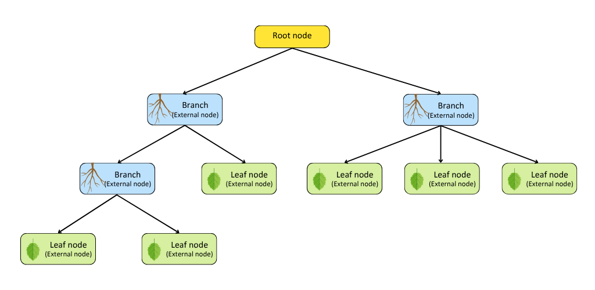

# Introduction to Decision Tree
In this chapter, we learn about what exactly us a tree structure and how a Decision Tree is used for Classification and Regression tasks.

## Structure of a Tree
A tree data structure, much like a real tree, grows from a root node and expands into multiple branches, with leaves at the ends.
- The root, unlike in nature, is positioned at the top and is considered an internal node. 
- Internal nodes (branches) have both incoming and outgoing edges, while external nodes (leaves) only have incoming edges.

## What is a Decision Tree?
Decision Tree is a Supervised Learning model, the model learns through a dataset of data with labels, and it slowly builds a hierarchy structure based on those inputs to help you reach a decision
