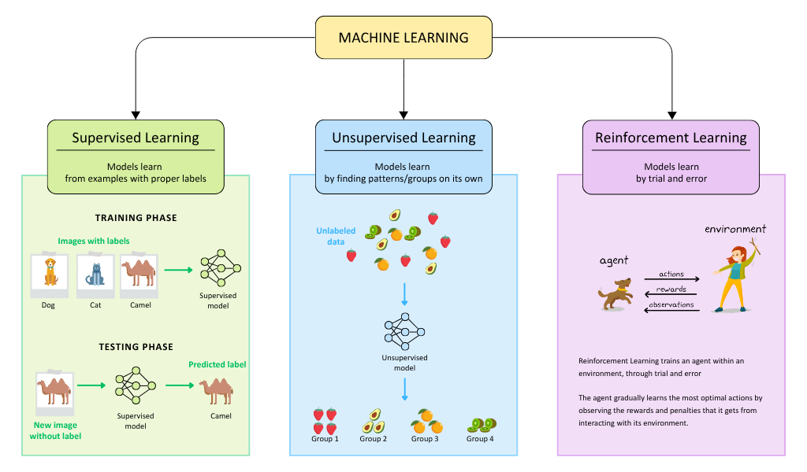

# Introduction to Decision Tree

## A brief overview of Machine Learning:
Humans acquire knowledge about the world around them through past experiences, whereas a computer can only follow instructions given by humans. But what if we can train machines to do what we can do at a much faster rate, by learning existing data as input? This is, to some extent, the definition of Machine Learning: the ability to learn, grow, and adapt of machines when exposed to unseen data.

Machine Learning is commonly divided into three main categories: Supervised Learning, Unsupervised Learning, and Reinforcement Learning, each serves a different purpose and/or task.

## Structure of a Tree
Much like a real tree, a tree data structure grows at the root and expands into multiple branches, with leaves emerging at the ends. However, unlike a natural tree, the root in a data structure is at the top.
Branches (internal nodes) are nodes that have both incoming and outgoing edges.
Leaves (external nodes) are nodes that **only have incoming edges**.

## What is a Decision Tree?
Decision Tree is a Supervised Learning model, and as you can see from the diagram above, the model learns through a dataset of data with labels, and it slowly builds a hierarchy structure based on those inputs to help you reach a decision
