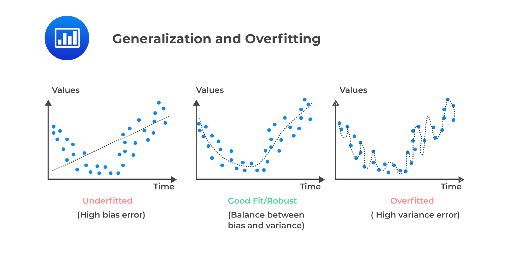

# A brief overview of Machine Learning:
Humans acquire knowledge about the world around them through past experiences, whereas a computer can only follow instructions given by humans. But what if we can train machines to do what we can do at a much faster rate, by learning existing data as input? This is, to some extent, the definition of Machine Learning: the ability to learn, grow, and adapt of machines when exposed to unseen data.

Machine Learning is commonly divided into three main categories: Supervised Learning, Unsupervised Learning, and Reinforcement Learning, each serves a different purpose and/or task.

## Model Training, Testing, and Generalization
When building a machine learning model, we split our data into two main parts: training data and testing data.

---

### Training Data

Training data is the part of the dataset used to teach the model.

- The model learns patterns from this data
- It adjusts its internal rules to reduce mistakes
- This is where learning actually happens

---

### Testing Data

Testing data is used to evaluate how well the model generalizes.

- The model does NOT see this data during training
- It is used to check real performance on new, unseen data
- It simulates real-world predictions

---

### Underfitting

Underfitting happens when the model is too simple to capture the patterns in the data.

Signs:
- Poor performance on training data
- Poor performance on testing data

---

### Overfitting

Overfitting happens when the model learns the training data too well, including noise and random patterns.

Signs:
- Very good performance on training data
- Poor performance on testing data

---

### Good Fit

A good model:
- Performs well on training data
- Performs well on testing data

It captures the true patterns without memorizing noise.

---
A visulization of what Underfitting and Overfiiting can look like. Source: @analystprep_overfitting_cfa_l2

